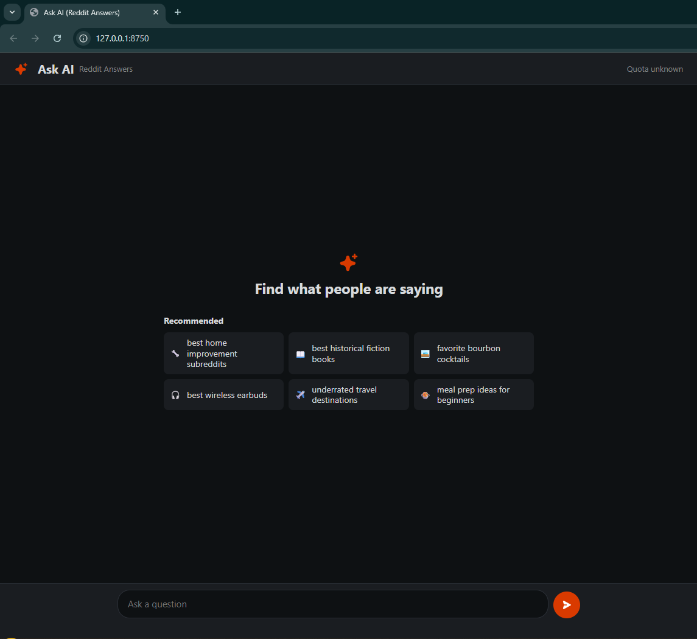
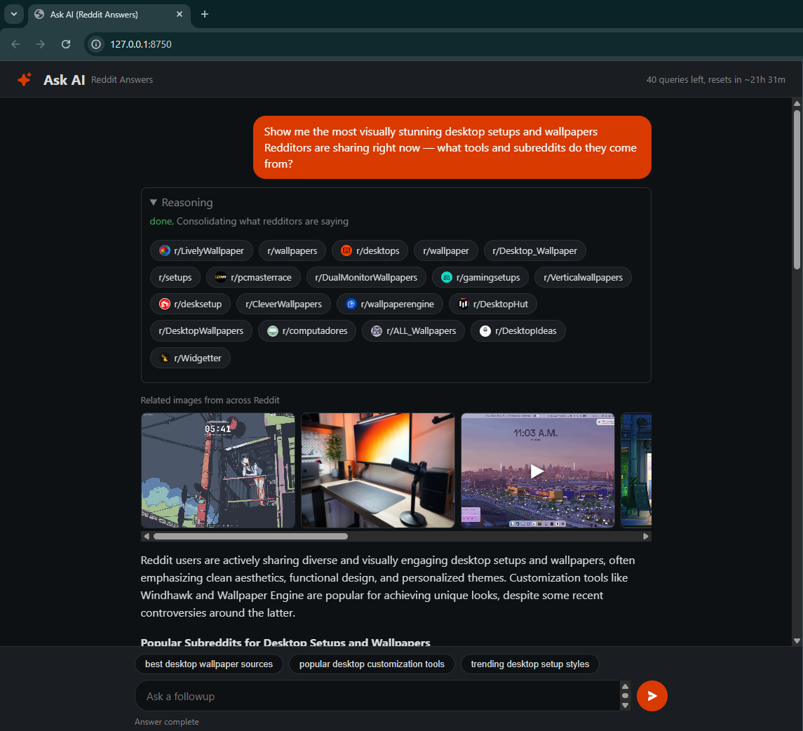
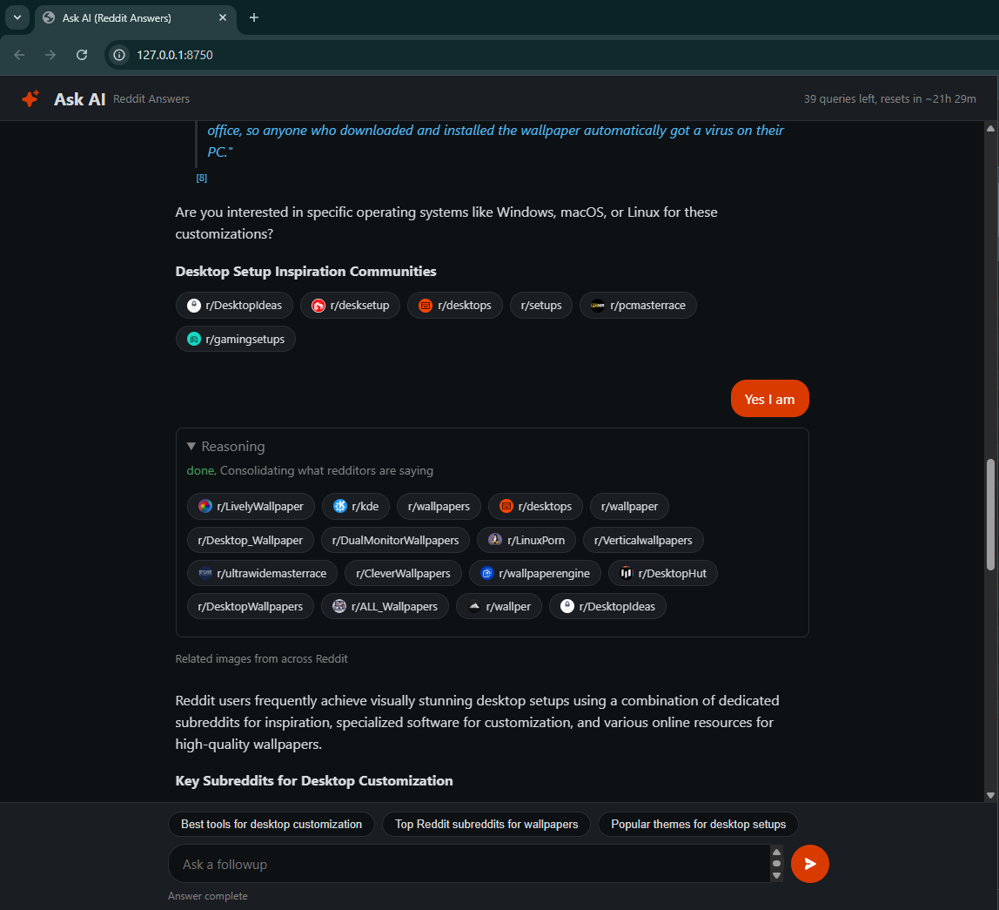
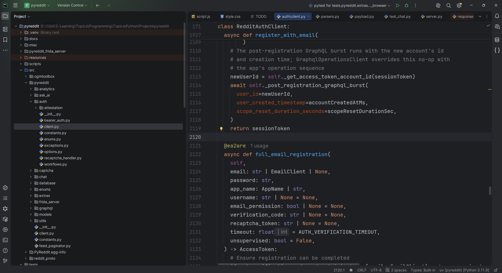

# Reddit App Client (Python)

A production-oriented Python client for Reddit's mobile application workflows. It speaks the
app's own protocol — not the public API — with generated protocol models, full account
lifecycle support, and source-verified behavior captured from the official mobile app.

This repository is a project showcase. The complete package (runtime source, generated
models, operation registry, documentation) is available for acquisition — see
[Contact](https://t.me/carlmj887804).

## Highlights

- **The complete app protocol: all 662 registered GraphQL operations** (375 queries,
  273 mutations, 14 subscriptions — the full operation surface of the Reddit app) with
  generated Pydantic request/response models, not hand-transcribed.
- **19 domain helper categories** with a clean, discoverable API over the generated layer —
  helper methods for the common workflows (posts, comments, votes, saving, reporting) and
  for community creation and styling, flairs, moderation queues, profiles, media, search,
  and relationships. No hand-built GraphQL payloads.
- **Complete account lifecycle**: credential login, email and phone registration and
  verification, full onboarding (preferences, interests, avatar), session and cookie
  handling with refresh, and device association.
- **Captcha backends**: third-party solvers (NextCaptcha, 2Captcha) or device-side
  integration for controlled environments. Pluggable — the owner decides which is primary.
- **Source-informed analytics**: event builders over generated protobuf models, with
  queued batch delivery or immediate delivery where the verified path requires it, and
  identity-aware filtering.
- **Matrix chat subsystem**: rooms, messages, media, reactions, stickers, read markers,
  and incremental sync.
- **Reddit Answers ("Ask AI")**: natural-language questions with streamed, source-cited
  answers, follow-up suggestions, and answer-quota visibility.
- **Persistence**: accounts, tokens, session cookies, Matrix credentials, and device
  identity via SQLite, PostgreSQL, or MySQL through a common repository API.
- **Async-first** (`httpx` + `asyncio`), with sessions that resume across processes.

## Screenshots

*(click to expand — live demo available on request)*

<b>Ask AI in action (Reddit Answers)</b> — streaming answers with source citations and follow-ups

<b>The codebase</b> — RedditAuthClient class glimpse

## What's included in the full package

- Runtime client with all subsystems listed above
- Generated GraphQL operation modules, input models, enums, and the operation registry
- Generated protobuf analytics models
- Analytics event builders and dispatch layer
- Persistence layer with multi-backend repositories
- Captcha client interfaces and shipped backends
- Sales documentation detailing every module

## Stack

Python 3.11+ · httpx · Pydantic · SQLAlchemy · betterproto2 · Quart (demo UI)

## Compliance note

This is app-level automation infrastructure for controlled environments. The acquirer is
responsible for compliance with Reddit's terms, applicable law, and their own operational
policies.

## Contact

Interested in acquiring the project, or want the full sales docs and a live demo?

- Telegram: **[@carlmj887804](https://t.me/carlmj887804)**

Serious inquiries only. Full documentation is shared after a short conversation, and a
live video demo/screenshare is available for qualified buyers.
